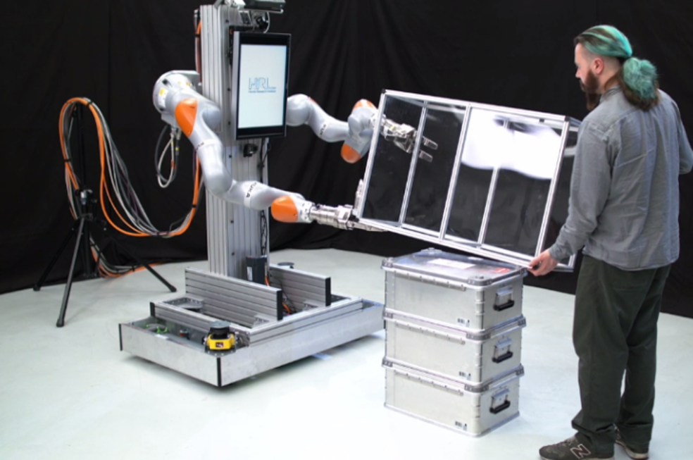

# DexterousCooperation
======================

DexterousCooperation is a software repository that contains most of the code
that has been written for a project on physical human-robot collaboration. The
below image shows one example, in which a person and a robot collaboratively 
rotate a box. The corresponding video is here: 
https://www.honda-ri.de/human-robot-cooperative-object-manipulation-with-contact-changes
The project depends on a few libraries for robot kinematics and control 
(https://github.com/HRI-EU/Rcs), trajectory generation (https://github.com/HRI-EU/Tropic), 
path planning (https://github.com/HRI-EU/Gras) and an entity-component header-only
library (https://github.com/HRI-EU/ESLib). It is written in C++ and requires
the standard C++11. 


<p float="left">
 
</p>
## License

This project is licensed under the BSD 3-clause license - see the [LICENSE.md](LICENSE.md) file for details


# Test program: TestDexterousCooperation

## Mode 1: Box demo

Start command simulator:

```
 bin/TestDexterousCooperation -m 1
```
  1. Press \"go to start\" button in GUI
  2. Optional: Check \"Auto accept all confirmation requests\" in GUI to enable movement to next canonical state
  3. Press 'o' for turning the box in one direction, 'i' to turn into the other direction

Start command real robot:

```
 bin/TestDexterousCooperation -m 1 -lbr1 -lbr2 -ime_odometry -ief -sdh1 -sdh2 -fts1 -fts2 -vic -ttc 6
```
  1. Press \"go to start\" button in GUI
  2. Press d twice in viewer window to enable IME
  3. Press t in viewer window to tare force torque sensors
  4. Check \"Auto\" in GUI to enable automatic triggering on sensor signals
  5. Enjoy playing around with the robot

## Mode 2: Wheel demo

### Start command simulator:

```
 bin/TestDexterousCooperation -m 2
```
  1. Press \"go to start\" button in GUI
  2. Press \"engage\" button in GUI
  3. Press \"close hands\" button in GUI
  2. Optional: Check \"Auto accept all confirmation requests\" in GUI to enable movement to next canonical state

### Start command real robot:

- Make sure that Vicon feedback is enabled in IMEComponent

```
 bin/TestDexterousCooperation -m 2 -lbr1 -lbr2 -ime_vicon -ief -sdh1 -sdh2 -fts1 -fts2 -vicon
```

  1. Press d twice in viewer window to enable IME
  2. Press \"Tare\" button in GUI
  3. Press \"go to start\" button in GUI
  4. Press t in viewer window to tare force torque sensors
  5. Press \"engage\" button in GUI
  6. Press \"close hands\" button in GUI
  7. Check \"Auto evaluate\" in GUI to enable automatic triggering on sensor signals

### Move platform back home:

  - Change iiwa control programs to position control

```
    bin/InitWheelBot -ime_vicon -vicon
    bin/InitWheelBot -lbr1 -sdh1
    bin/InitWheelBot -lbr2 -sdh2
```


# Test program: TestPoseGraph

```
    bin/Rcs -m 5 -alpha 1 -algo 1 -lambda 0 -f config/xml/DexterousCooperation/PoseGraph/mode1/cHandDefinedCoupledJoints.xml -scaleDragForce 0.5 -dt 0.025
    bin/Rcs -m 5 -alpha 1 -algo 1 -lambda 0 -f config/xml/DexterousCooperation/PoseGraph/mode1/cHandDefinedExplicitConstraints.xml -scaleDragForce 0.5 -dt 0.025
```


# Test program: TestPolygonPlanner

See the [DcVision](src/DcVision/README.md) for the cool polygon detection and planning project.

## Mode 1: Contact point processing in graphics window

## Mode 2: Simulation / real system in action

### Start command simulator:

```
    bin/TestPolygonPlanner -m 1
```

### Start command real system:

```
    source ~/ros-melodic.env
    export ROS_MASTER_URI=http://dexcoop-01:11311
    bin/TestPolygonPlanner -m 1 -ros -ime_odometry -ief -lbr1 -lbr2 -sdh1 -sdh2
```

  - Hit d to enable IME
  - To toggle updating from ROS, use message GetPolygonsFromROS (in EventGui)
  - To see from the robot's camera perspective, use message SetViewFromKinect

### Here are a few useful ROS commands:


```
    ROS topic: /dexco/polygon
    ROS_MASTER_URI=http://dexcoop-01:11311

    source /opt/ros/<ros-version>/setup.bash
    rostopic list
    rqt_image_view
    rostopic echo /dexco/polygon
    rostopic info /dexco/polygon
    rostopic hz /dexco/polygon
```

- How to show overlays
  - source ~/ros-melodic.env
  - set ROS_MASTER_URI
  - rqt_image_view
    - /dexco/plane_segmentation
    - /dexco/rgb_overlay


# Test program: ExampleDcComponents

## Jaco mode

- Single joint control:

```
    bin/ExampleDcComponents -m 1 -dir config/xml/Scitos/ -f kinova_ulw2_6dof.xml -jaco
```

- Trajectory control:
```
    bin/ExampleDcComponents -m 3 -dir /home/mgienger/AllRcs/RcsConfigFiles/xml/Scitos -f cAction.xml -jaco
```


# Developer's section
=====================

## Trouble shooting:

  - CANBlaBla cannot be found: 
```
    export LD_LIBRARY_PATH=lib:$LD_LIBRARY_PATH
```
  - VICON PC locked: see DexterousCooperation/Support/Computing/vicon-pc

  - Can't connect to Jaco due to more than one USB device:
    - Switch of other Jacos
    - Problem also exists if one USB-Jaco is operated along with networked Jacos

## Event validation

  - pip install clang==10.0.1 tqdm colorama
  
## FAQ

  - Why don't you make import libraries from rapidjson, ESlib etc.?
    - Because this breaks the event validation due to some white-listing issue with SOURCES and SOURCE_DIR

## To Do

  - Remove SearchNode.h from StateEstimatorComponent and other files that only have it for the vec3Str() function
  - BoxObjectModel::triggerExecutionVisualization enable Holo-Code somehow
  - Activate HoloComponent in TestDexterousCooperation 
  - Activate WITH_INTENTION_VISUALIZATION in TestDexterousCooperation 

## Done

  - Re-activate compliance wrench event in WheelPlanner
  - Activate WITH_COMPLIANCE_WRENCH in TestDexterousCooperation 
  - Check if StateEstimatorComponent is still needed or can be removed -> no, still needed. Subscribes to PostUpdateGraph, and publishes the search state.
